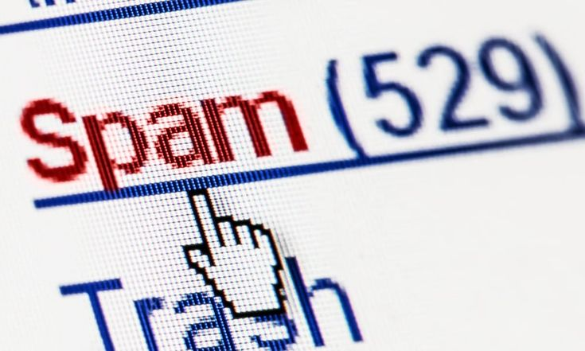

 <!-- You can replace this with your custom pink-themed banner -->

# 📢 Spam Detection Using Machine Learning

> 🚀 A binary classification project where I built models to detect whether an email is **spam or not spam** using the Spambase dataset.  

This repository contains the implementation of two powerful machine learning classifiers applied to email data:  
- 🎯 **Random Forest Classifier**  
- ⚡ **AdaBoost Classifier**

Both models were trained, tested, and evaluated on real-world spam data to analyze performance and feature relevance.

---

## 🔍 Techniques Used

### 🌲 Random Forest Classifier
An ensemble model that constructs multiple decision trees and classifies emails based on a majority vote.  
**Accuracy Achieved:** `85%`

### ⚡ AdaBoost Classifier
An adaptive boosting model that focuses on correcting the errors of weak learners iteratively.  
**Accuracy Achieved:** `91%`

---

## 📊 Feature Engineering & Insights

- 🔠 **Text Patterns**: Words like `"free"`, symbols like `"$"`, and excessive **capital letters** were strong spam indicators.
- 🧠 **Feature Importance**: Used built-in tools to interpret which features influenced predictions most.

---

## 🛠️ Tech Stack

- Python 🐍  
- scikit-learn  
- pandas & NumPy  
- matplotlib & seaborn  

---

## 📈 Results & Takeaways

- AdaBoost outperformed Random Forest in precision and overall accuracy.
- Understanding the dataset’s feature significance helped refine model performance.
- Ensemble methods show strong potential for spam filtering systems.

---

## 🚧 Future Work

- 🧪 Experiment with NLP-based models like Naive Bayes or BERT.
- 🔍 Add pre-processing for raw email datasets (stemming, tokenization).
- 📬 Deploy as a basic web app for live spam detection.

---

## 📂 Dataset

Dataset used: [UCI Spambase](https://archive.ics.uci.edu/ml/datasets/spambase)

---

## 🤝 Connect

Feel free to reach out or fork this repo for collaboration or experimentation.

---
> _Built with love for clean code and curiosity._  
> _– Rosu 🧠🌸_
